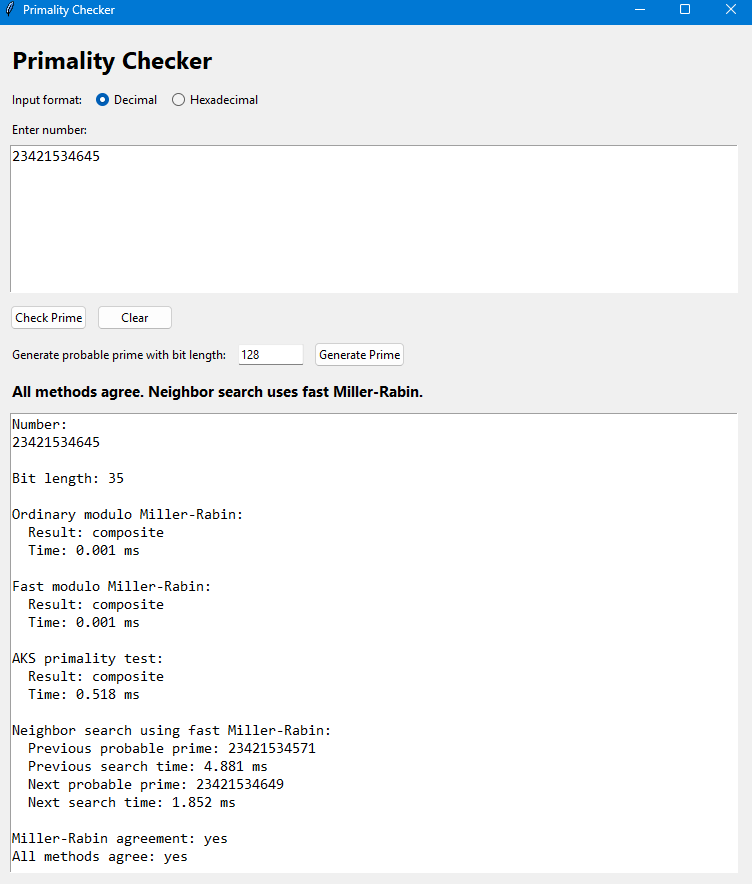
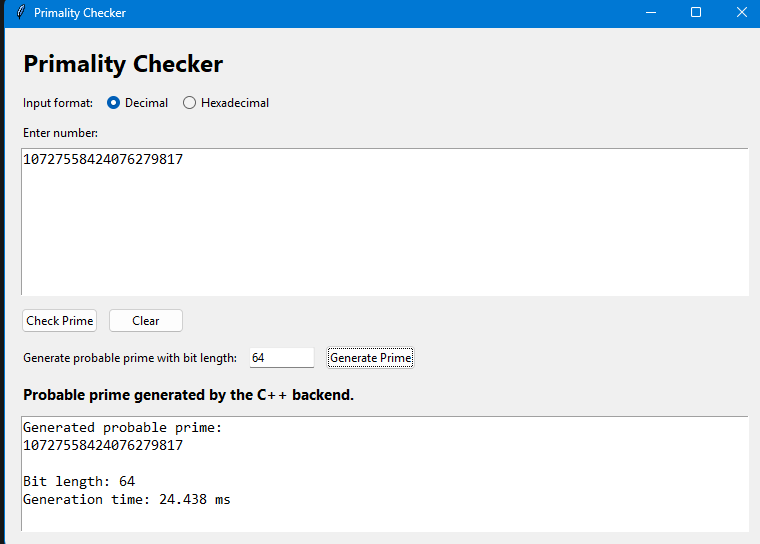
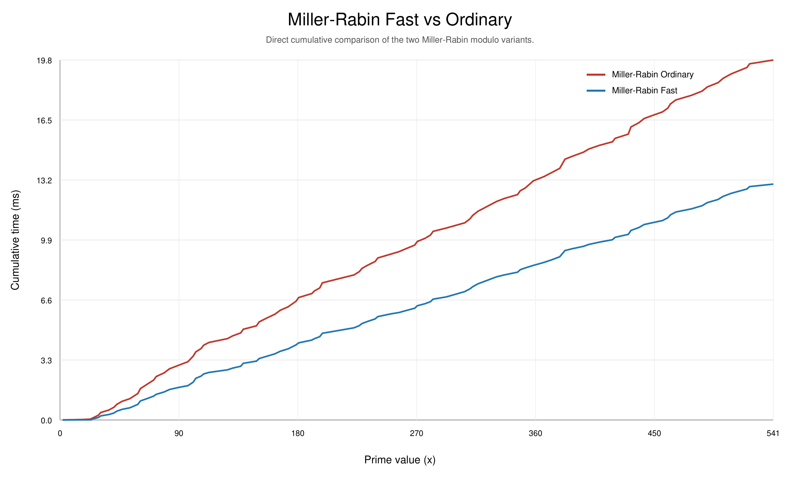
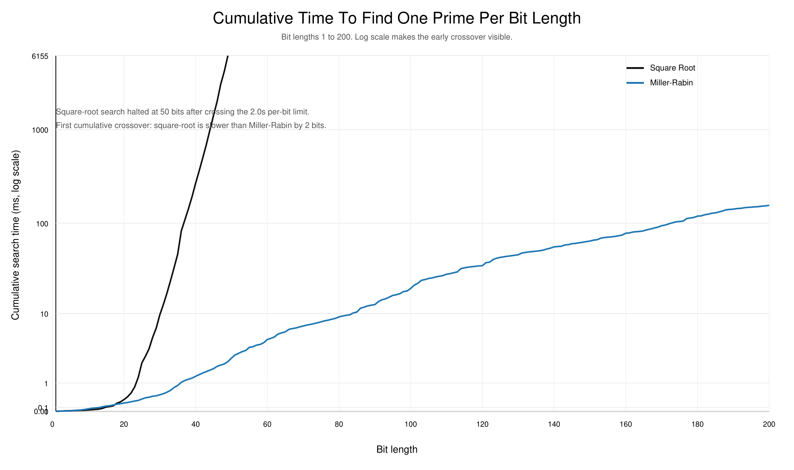
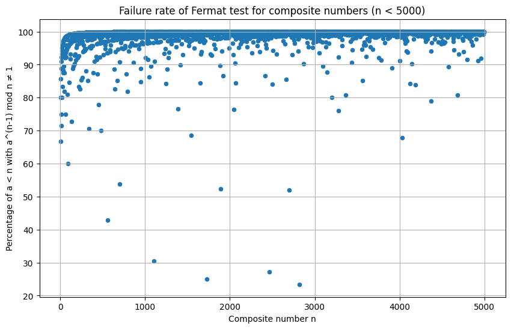

# Primality Testing: Theory, Implementation, and Experimental Comparison

This repository is the final CS648 project submission for a complete primality-testing study that combines theory, implementation, experimentation, and user-facing tools in one place.

The project compares:
- a simple square-root primality baseline
- Miller-Rabin using ordinary modular arithmetic
- Miller-Rabin using a faster modular reduction path
- the deterministic AKS primality test
- Fermat-test behavior on composites and Carmichael numbers

Alongside the algorithms, the repository includes:
- a custom `big_int` implementation for large integer arithmetic
- a C++ console program for manual testing and dataset-based checking
- a C++ backend used by a Python Tkinter GUI
- prime generation and neighbor-prime search
- benchmark scripts and generated figures
- the final report and presentation sources

## Project Highlights

- Implemented a custom `big_int` class and used it to support large-number primality testing.
- Built two Miller-Rabin variants to compare ordinary modulo against a faster modular reduction path.
- Integrated AKS to contrast a deterministic primality test with practical probabilistic methods.
- Added a GUI applet for prime checking, prime generation, and previous/next-prime lookup.
- Added a backend CLI so the algorithms can also be scripted and benchmarked.
- Produced benchmark plots showing how runtime changes with input size and search strategy.
- Included experimental figures illustrating why Fermat's test can fail on Carmichael numbers.

## Quick Start

Build the backend:

```powershell
g++ -std=c++17 -O2 -Wall -Wextra -pedantic primality_backend.cpp big_int.cpp miller_rabin.cpp aks.cpp -o primality_backend.exe
```

Run the GUI:

```powershell
python primality_gui.py
```

Check a number directly from the backend:

```powershell
.\primality_backend.exe check dec 101
.\primality_backend.exe check hex FF
.\primality_backend.exe generate 128
```

## What The Project Implements

### 1. Square-root primality test

This is the classical exact baseline:
- for an integer `n`, test divisibility up to `sqrt(n)`
- exact, simple, and easy to explain
- becomes impractical quickly as numbers grow

Main reference file:
- `simple-square-root-algo.cpp`

### 2. Miller-Rabin with ordinary modulo

This version uses the regular modular arithmetic path in the project.

Properties:
- practical and fast
- probabilistic for general inputs
- useful as the main high-speed primality checker

### 3. Miller-Rabin with fast modulo

This version uses a faster modular reduction path while keeping the same Miller-Rabin logic.

Properties:
- same primality logic as the ordinary version
- intended to measure arithmetic-performance gains
- used in the backend, console testing, GUI, and benchmarks

Main implementation files:
- `miller_rabin.cpp`
- `miller_rabin.h`
- `big_int.cpp`
- `big_int.h`

### 4. AKS primality test

AKS is the deterministic primality-testing algorithm included for comparison.

Properties:
- deterministic and exact
- much slower than Miller-Rabin in practice for this project
- useful as a theory-grounded reference point in the experiments

Main files:
- `aks.cpp`
- `aks.h`

Important note:
- The AKS code implementation in this repository was written using ChatGPT.

## User Interfaces and Workflow

The project can be used in three main ways:

1. GUI workflow  
   Build `primality_backend.exe`, then run `python primality_gui.py`.

2. Backend CLI workflow  
   Use `primality_backend.exe` directly for checking numbers or generating primes.

3. Console workflow  
   Build and run `primality_testing_app.exe` for menu-based testing and dataset evaluation.

The overall flow is:

```text
Input number / bit length
        |
        v
     big_int
        |
        v
Miller-Rabin / AKS / helper search
        |
        +--> GUI results
        +--> CLI output
        +--> benchmark scripts
```

## GUI Screenshots

Prime checking interface:



Prime generation interface:



The GUI supports:
- decimal input
- hexadecimal input
- Miller-Rabin ordinary result and timing
- Miller-Rabin fast result and timing
- AKS result and timing
- agreement checks between methods
- previous probable prime lookup
- next probable prime lookup
- probable-prime generation by bit length

## Repository Structure

```text
.
|-- big_int.cpp / big_int.h
|-- miller_rabin.cpp / miller_rabin.h
|-- aks.cpp / aks.h
|-- primality_backend.cpp
|-- primality_gui.py
|-- main.cpp
|-- benchmark.cpp
|-- plot_benchmark.py
|-- plot_prime_cumulative_benchmark.py
|-- plot_pairwise_comparisons.py
|-- plot_bit_length_prime_search_comparison.py
|-- generate_aks_miller_rabin_report_plots.py
|-- by_using_fermat_little.cpp
|-- prime_dataset.json
|-- primes1_till_1e8.txt
|-- primes_100_to_200_bits.csv
|-- 100_bit_primes.txt
|-- experiment_plots/
|-- gui_pictures/
|-- images/
|-- CS648_Project_Report_Group_230272.tex
|-- CS648_Project_Report_Group_230272_updated.pdf
|-- primality_ppt.tex
|-- primality_ppt_updated.pdf
```

## Build Instructions

### Build the backend used by the GUI and scripts

```powershell
g++ -std=c++17 -O2 -Wall -Wextra -pedantic primality_backend.cpp big_int.cpp miller_rabin.cpp aks.cpp -o primality_backend.exe
```

### Build the console application

```powershell
g++ -std=c++17 -O2 -Wall -Wextra -pedantic main.cpp big_int.cpp miller_rabin.cpp aks.cpp -o primality_testing_app.exe
```

### Build the Miller-Rabin runtime benchmark

```powershell
g++ -std=c++17 -O2 -Wall -Wextra -pedantic benchmark.cpp big_int.cpp miller_rabin.cpp -o benchmark.exe
```

### Notes

- The main project code uses standard C++17.
- The GUI requires Python 3 with Tkinter.
- Most plotting scripts in this repository use only Python standard-library modules and generate SVG output directly.
- `generate_aks_miller_rabin_report_plots.py` additionally uses `matplotlib` because it regenerates the report-ready PNG figures.
- `by_using_fermat_little.cpp` is an auxiliary experiment file and uses Boost.Multiprecision.

## How To Run

### GUI applet

Run:

```powershell
python primality_gui.py
```

What it does:
- checks primality using Miller-Rabin ordinary, Miller-Rabin fast, and AKS
- reports runtimes for each method
- shows whether all methods agree
- reports the previous and next probable prime near the input
- generates a probable prime for a requested bit length

Important note:
- the previous/next-prime search uses fast Miller-Rabin, so these neighbors are reported as probable primes

### Backend CLI

Check a decimal number:

```powershell
.\primality_backend.exe check dec 100
```

Check a hexadecimal number:

```powershell
.\primality_backend.exe check hex FF
```

Generate a probable prime:

```powershell
.\primality_backend.exe generate 128
```

The `check` command reports:
- the input number
- bit length
- Miller-Rabin ordinary result and runtime
- Miller-Rabin fast result and runtime
- AKS result and runtime
- previous probable prime and search time
- next probable prime and search time
- agreement flags between methods

### Console application

Run:

```powershell
.\primality_testing_app.exe
```

The console program offers:
- testing one decimal number
- testing one hexadecimal number
- running a batch accuracy test from a Wycheproof-style JSON dataset

Dataset mode uses:
- `prime_dataset.json` or another compatible JSON file
- a user-selected minimum bit length

It prints:
- number of vectors seen
- number of vectors tested
- number skipped below the threshold
- ordinary-modulo accuracy
- fast-modulo accuracy
- agreement between both Miller-Rabin variants

## Benchmarking and Experiments

This repository includes several benchmark and experiment workflows.

### 1. Miller-Rabin ordinary vs fast modulo

Files:
- `benchmark.cpp`
- `plot_benchmark.py`

Run:

```powershell
.\benchmark.exe
python plot_benchmark.py
```

Outputs:
- `benchmark_times.csv`
- `benchmark_plot.svg`

Purpose:
- compares the two Miller-Rabin arithmetic variants across bit lengths

### 2. Cumulative benchmark on prime inputs

Files:
- `plot_prime_cumulative_benchmark.py`
- `primes1_till_1e8.txt`

Run:

```powershell
python plot_prime_cumulative_benchmark.py --max-primes 100
```

Outputs:
- `prime_cumulative_benchmark.csv`
- `prime_cumulative_benchmark.svg`

Purpose:
- benchmarks cumulative runtime on prime inputs
- compares square-root testing, Miller-Rabin ordinary, Miller-Rabin fast, and AKS

Important note:
- AKS becomes slow very quickly, so large runs should be done carefully

### 3. Pairwise runtime comparison plots

File:
- `plot_pairwise_comparisons.py`

Recommended run command:

```powershell
python plot_pairwise_comparisons.py --output-dir images
```

Generated figures include:
- `images/square_root_vs_miller_rabin.svg`
- `images/miller_rabin_fast_vs_ordinary.svg`
- `images/aks_vs_miller_rabin.svg`

Purpose:
- makes side-by-side cumulative-runtime comparisons easier to present and analyze

### 4. Bit-length prime-search benchmark

File:
- `plot_bit_length_prime_search_comparison.py`

Run:

```powershell
python plot_bit_length_prime_search_comparison.py --min-bits 1 --max-bits 200 --sqrt-max-seconds-per-bit 2.0
```

Outputs:
- `bit_length_prime_search_benchmark.csv`
- `images/bit_length_prime_search_comparison.svg`
- `images/bit_length_prime_search_comparison_log.svg`

Purpose:
- for each bit length, finds the first prime of that size
- compares cumulative search time for square-root search and Miller-Rabin
- stops the square-root side early when it becomes too slow

### 5. Fermat and Carmichael experiment figures

Files:
- `experiment_plots/failure_fermat.png`
- `experiment_plots/failure_fermat_among_gcd(a,n)_1.png`
- `by_using_fermat_little.cpp`

Purpose:
- illustrates where Fermat-based reasoning can fail on Carmichael numbers
- highlights the witness behavior for non-Carmichael composites
- supports the theoretical discussion that non-Carmichael composites have many bases that expose compositeness

Note:
- the generated experiment figures are included in the repository
- `by_using_fermat_little.cpp` is an auxiliary experimental file in the repo, but the exact plotting script for these final images is not part of the current tree

### 6. Regenerating the AKS and Miller-Rabin report figures

File:
- `generate_aks_miller_rabin_report_plots.py`

This script regenerates these figure files:
- `images/aks_runtime_plot.png`
- `images/miller_rabin_runtime_plot.png`
- `images/aks_vs_miller_rabin_plot.png`
- `images/aks_miller_rabin_ratio_plot.png`
- `images/aks_vs_miller_rabin_extended_plot.png`

Default assumed CSV inputs:
- `aks_runtime_samples.csv`
- `miller_rabin_runtime_samples.csv`

Expected CSV columns:
- `bit_length`
- `runtime_ms`

Notes:
- multiple rows per bit length are allowed
- the script computes the average runtime per bit length automatically
- these large CSV files are assumed to exist locally and are not required to be committed to the repository

Run:

```powershell
python generate_aks_miller_rabin_report_plots.py
```

If your CSV files have different names:

```powershell
python generate_aks_miller_rabin_report_plots.py --aks-csv my_aks_data.csv --mr-csv my_miller_rabin_data.csv
```

## Selected Figures

Miller-Rabin ordinary vs fast modulo:



Bit-length prime-search comparison on log scale:



Fermat failure experiment:



## Main Results and Takeaways

- Miller-Rabin is the practical winner in this project and is dramatically faster than square-root search and AKS on larger inputs.
- The fast-modulo Miller-Rabin implementation improves runtime over the ordinary-modulo variant in the benchmark study.
- AKS is valuable as a deterministic comparison point, but it is not competitive with Miller-Rabin for practical use here.
- In the bit-length prime-search benchmark, square-root search becomes impractical and is stopped early once the per-bit time limit is exceeded.
- The Fermat experiment figures reinforce that Carmichael numbers can fool Fermat-style tests, which motivates stronger tests such as Miller-Rabin.

## Final Documents

Report source:
- [CS648_Project_Report_Group_230272.tex](CS648_Project_Report_Group_230272.tex)

Final report PDF:
- [CS648_Project_Report_Group_230272_updated.pdf](CS648_Project_Report_Group_230272_updated.pdf)

Presentation source:
- [primality_ppt.tex](primality_ppt.tex)

Presentation PDF:
- [primality_ppt_updated.pdf](primality_ppt_updated.pdf)

## Notes and Limitations

- Miller-Rabin returns a probable-prime result, not a deterministic proof of primality.
- The neighbor-prime search in the GUI and backend uses fast Miller-Rabin, so it also returns probable primes.
- AKS is exact but slow in this codebase and is mainly included for comparison and study.
- The square-root method is included as a simple exact baseline, not as a scalable solution.
- Some `.exe`, `.csv`, `.svg`, `.png`, `.pdf`, and LaTeX auxiliary files in the repository are generated artifacts from experiments and documentation builds.

## Attribution and References

- M. Agrawal, N. Kayal, and N. Saxena, *PRIMES is in P*, Annals of Mathematics, 160(2), 781-793, 2004.
- G. L. Miller, *Riemann's Hypothesis and Tests for Primality*, Journal of Computer and System Sciences, 1976.
- M. O. Rabin, *Probabilistic Algorithm for Testing Primality*, Journal of Number Theory, 1980.
- The AKS code implementation included in this repository was written using ChatGPT.

## Summary

This project is not just a single primality checker. It is a combined theory-and-systems project that studies exact and probabilistic testing, compares their runtime behavior, builds interactive tooling around them, and documents the results through a report, presentation, plots, and experiments.
